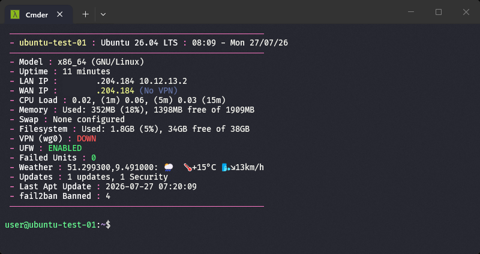

# motd-stats

A login banner (MOTD) for Debian-based servers — Ubuntu, Raspbian/Raspberry Pi OS,
and generic Debian — showing system, security, and ops stats over SSH.



## Features

- Hostname, OS, uptime, CPU temp (if a sensor exists), load, memory, swap, disk
- LAN/WAN IP, with an optional VPN-leak check against a domain you own
- WireGuard (or other) VPN interface status, if configured
- UFW status, Docker container counts, fail2ban banned-IP count — all auto-detected,
  each line only appears if the tool is installed
- Failed systemd units, reboot-required flag, last apt update, available updates
- Last failed login (via fail2ban)
- Weather (via wttr.in)

Everything not explicitly configured is auto-detected at runtime, so the same
script runs unmodified across hosts with different setups.

## Install

Clone the repo and run:

```bash
git clone https://github.com/shanemc92/motd-stats.git
cd motd-stats
bash install.sh
```

Or, on a fresh server, pull and run directly (keeps `read` prompts working):

```bash
MOTD_STATS_URL="https://raw.githubusercontent.com/shanemc92/motd-stats/main/motd-stats.sh" \
  bash <(curl -sL https://raw.githubusercontent.com/shanemc92/motd-stats/main/install.sh)
```

The installer asks a few questions and auto-detects the rest:

- VPN interface to monitor (blank to skip)
- A domain resolving to this server's public IP, for the VPN-leak check (blank to skip)

It then deploys the script to `/usr/bin/scripts/motd-stats.sh`, sets up the `motd`
and `update` aliases, disables the default MOTD/last-login noise, adds passwordless
sudo for `ufw status` / `fail2ban-client status` (only if those tools are present),
and schedules a nightly `apt update` via cron (installed automatically if missing -
Ubuntu minimal cloud images ship without it by default). Safe to re-run — it won't
duplicate aliases, cron entries, or sudoers files.

## Configuration

Settings live in `/etc/motd-stats.conf`, written by the installer:

```bash
VPN_IFACE="wg0"
MY_DOMAIN="example.com"
SHOW_DOCKER_IPS=false
DOCKER_SOCKET_PROXY=""
```

Edit this file directly to change settings later without re-running the installer.

## Uninstall

```bash
bash uninstall.sh
```

Removes the deployed script, config, sudoers rules, groups, aliases, and cron
entry.  `sshd_config` and `/etc/motd` are restored from the backups install.sh
made on first run.

## License

MIT — see [LICENSE](LICENSE).
